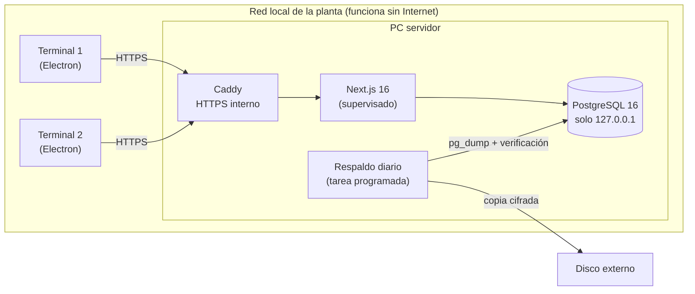

# Sistema de gestión para secaderos de yerba mate

[English](README.md) · **Español**

Sistema de gestión operativa que usa **todos los días** un secadero de yerba mate en Misiones, Argentina. Lo diseñé, desarrollé y mantengo yo solo, y hoy lo comercializo a otros secaderos.

> El código fuente es privado porque es un producto comercial. Este repositorio es un **caso de estudio**: el problema, cómo está armado y por qué tomé cada decisión técnica. Las capturas salen de la versión de prueba, con datos inventados.


## El problema

Un secadero recibe camiones de hoja verde de decenas de productores, la seca, la estaciona y la entrega a molinos y clientes. Antes del sistema, el pesaje, el stock (la *canchada*) de cada dueño, el depósito y los retiros se llevaban en papel y planillas de Excel.

Las restricciones reales eran estas:

- **Internet rural poco confiable.** Si se corta, la báscula no puede dejar de pesar.
- **Varias computadoras a la vez**, trabajando sobre los mismos datos.
- **Los números tienen que cerrar.** Los kilos del stock, los comprobantes y los reportes salen de los mismos movimientos. Un número que no coincide es plata de alguien.
- **No se puede perder un solo dato**, y del otro lado no hay un equipo de IT: hay gente trabajando.

## Qué hace

| Módulo | Descripción |
| --- | --- |
| **Recepción** | Ingreso en báscula, tara, cálculo de kilos netos y comprobante impreso en original, duplicado y triplicado |
| **Canchada** | Stock por titular (secadero y clientes) con rendimiento técnico pactado |
| **Depósito** | Mapa del galpón por sectores, con los nombres que usa la planta |
| **Retiros** | Salidas a molinos y clientes, con cuenta corriente por cliente |
| **Leña** | Cuenta corriente de proveedores de leña y comprobantes de entrega |
| **Padrón INYM** | Padrón oficial del Instituto Nacional de la Yerba Mate (más de 15.000 operadores) integrado para dar de alta productores |
| **Reportes** | Por zafra, productor y período, con exportación a Excel |

<p>
  
  
</p>
<p>
  
  
</p>

## Arquitectura



- **Servidor:** Next.js 16 (App Router, Server Actions) + Prisma 7 + PostgreSQL 16, empaquetado con Electron como aplicación de Windows.
- **Terminales:** clientes livianos de Electron que cargan el servidor por la red local. **Al actualizar el servidor se actualizan todas las pantallas**, sin reinstalar nada en cada terminal.
- **Caddy** es lo único expuesto a la red, con su propia autoridad certificante interna. PostgreSQL solo escucha en `127.0.0.1`.

## Decisiones técnicas

### 1. De la nube a on-premise
El piloto arrancó con Supabase. Lo migré a un servidor local porque el Internet de la zona no es confiable y **la planta no puede frenar por un corte**. Hice la migración con snapshots de conteos por tabla antes y después, y la comparé antes de dejar de usar la base en la nube.

### 2. Migraciones seguras en producción, sin Node en el servidor
La PC servidor no tiene Node ni el proyecto, así que `prisma migrate deploy` no es una opción. En su lugar:
- Genero un `.sql` por entrega **desde el commit exacto de la versión que se instala**, no desde `main`.
- Todo corre en una sola transacción y **tiene una guarda: si alguna migración ya estaba aplicada, aborta sin tocar nada.**
- Antes de actualizar, comparo lo que tiene la base con lo que espera el código mediante una **huella SHA-256** de la lista de migraciones aplicadas, calculada por el propio PostgreSQL. Así no dependo de transcribir nombres a mano:

```sql
SELECT count(*), encode(sha256(convert_to(
  string_agg(migration_name, chr(10) ORDER BY migration_name), 'UTF8')), 'hex')
FROM _prisma_migrations WHERE finished_at IS NOT NULL AND rolled_back_at IS NULL;
```

### 3. Respaldos que se verifican, no que "se hacen"
- `pg_dump` diario con verificación de lectura (`pg_restore --list`).
- **Restauración de prueba** opcional: el respaldo se restaura en una base temporal, se cuentan las filas recuperadas y la base temporal se borra. Es la única prueba real de que un respaldo sirve.
- La copia que sale del edificio va **cifrada con AES-256-CBC + HMAC-SHA256**, en PowerShell puro. No usé AES-GCM porque comprobé que `AesGcm` no existe en PowerShell 5.1, que es lo que trae el servidor.
- Hay un procedimiento de recuperación ante fallas escrito para seguir paso a paso bajo presión, con una regla de oro: *primero conservar, después arreglar*.

### 4. Un servidor que se recupera solo, sin volverse loco
Un supervisor reinicia el servidor si deja de responder, con esperas crecientes (2 s → 60 s) y un límite de reintentos. **Nunca toca un servidor sano**: no hay reinicios programados.

### 5. Versión de prueba autoinstalable
Para venderlo a otros secaderos armé un instalador de prueba de 30 días pensado para la PC de alguien que **no es administrador de su máquina y no tiene a quién llamar**:
- PostgreSQL 16 embebido: crea el cluster y aplica las migraciones al primer arranque.
- No requiere permisos de administrador.
- Sistema de licencias con vencimiento.
- **Corre el mismo `src/` que producción**, no una copia que se desactualiza.
- Los datos de ejemplo se generan con una **semilla fija**, así cada demo muestra exactamente los mismos números, y **pasan por las mismas funciones de dominio que una recepción real**, así el stock y los reportes cierran.

### 6. El lenguaje de la planta manda
Los sectores del depósito se llaman como les dicen en el galpón ("ZAFRA 2024", "YERBA DE CÁMARA"), no con coordenadas como A1 o B2. Si el sistema obliga a traducir, nadie lo usa para buscar.

## Stack

- **Frontend:** React 19, Next.js 16, Tailwind CSS 4
- **Backend y datos:** Node.js, Server Actions, Prisma 7, PostgreSQL 16, Zod
- **Escritorio e infraestructura:** Electron, electron-builder, Caddy, tareas programadas de Windows, PowerShell
- **Testing:** Playwright (end-to-end) y `node:test`. Los tests unitarios ejecutan de verdad los scripts de PowerShell de cifrado y respaldo.

## En números

- Desarrollado desde **mayo de 2026**, hoy en producción con la **versión 0.6.0**
- **36 modelos** de datos y **más de 40 migraciones** aplicadas en producción sin pérdida de datos
- **15.000+ operadores** del padrón INYM integrados

## Autor

**Franco Olexyn**, estudiante de Ingeniería en Sistemas de Información (UCP)
[LinkedIn](https://www.linkedin.com/in/franco-olexyn-0a058a304/) · francoolexynn@gmail.com

¿Te interesa ver una demo o el sistema para tu secadero? Escribime.
