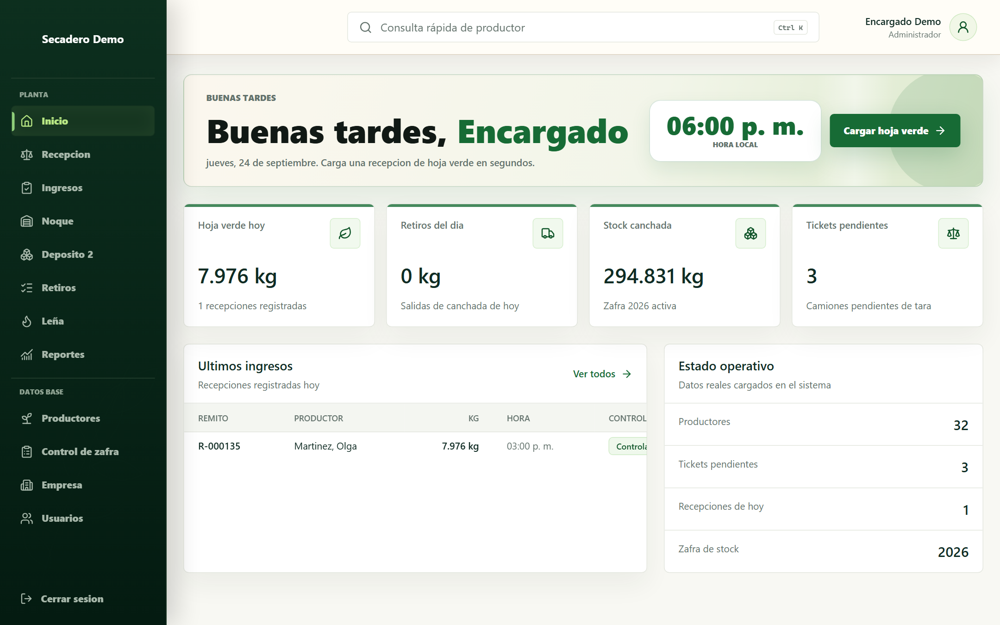
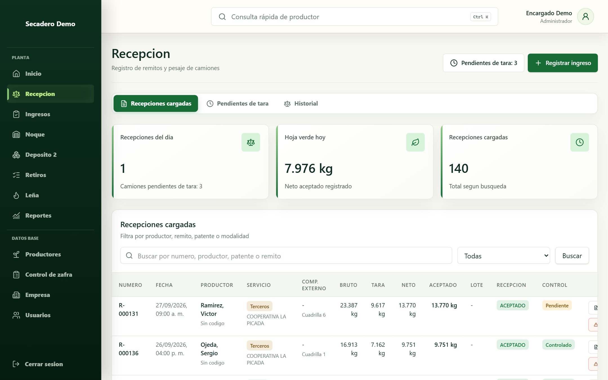
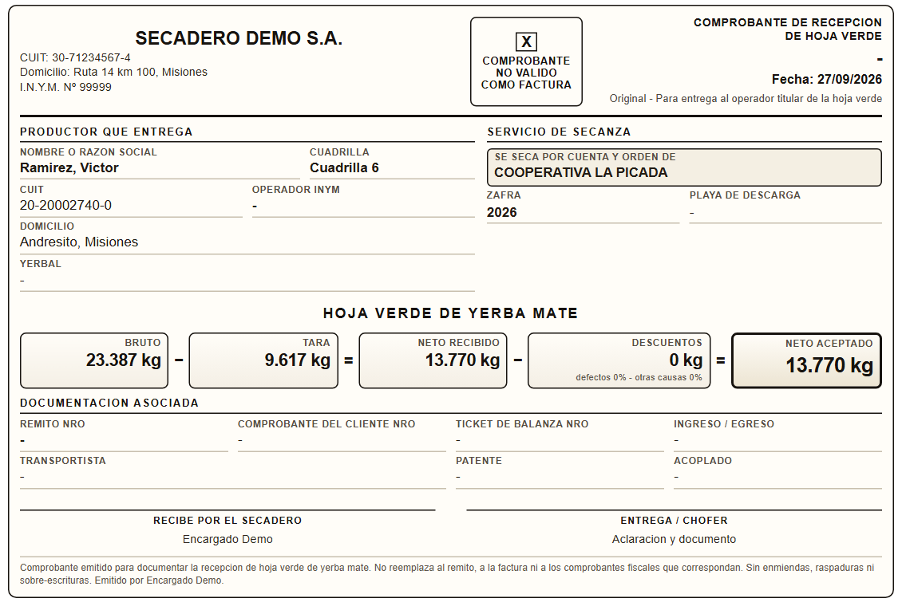
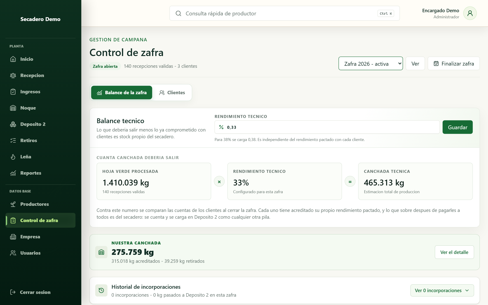
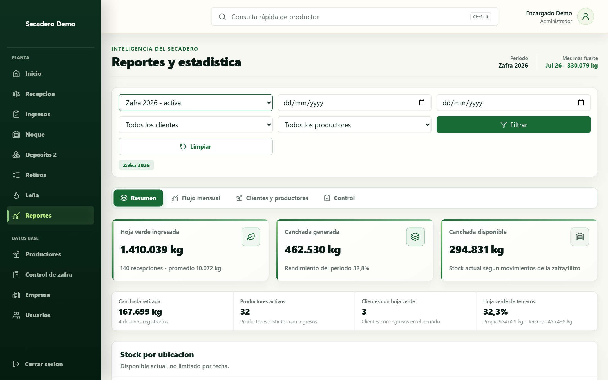
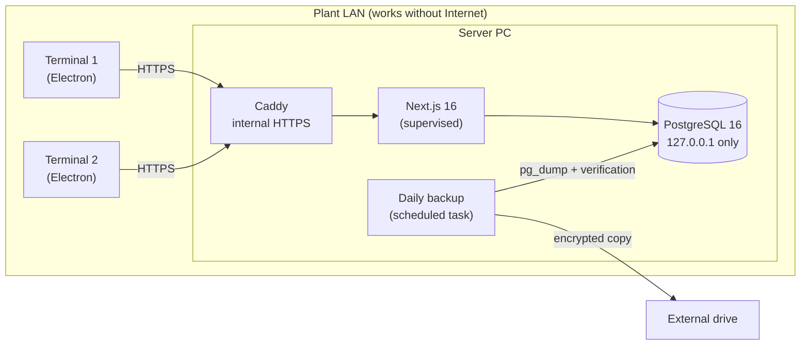

# Management System for Yerba Mate Drying Plants

**English** · [Español](README.es.md)

An operations management system used **every day** at a yerba mate drying plant in Misiones, Argentina. I designed, built, and maintain it on my own, and I'm now selling it to other plants.

> The source code is private because this is a commercial product. This repository is a **case study**: the problem, how the system is built, and why I made each technical decision. Screenshots come from the trial version, with made-up data. The UI is in Spanish, the language of its users.



## The problem

A drying plant receives trucks of green yerba mate leaf from dozens of growers, dries it, stores it, and ships it to mills and clients. Before this system, truck-scale weighing, each owner's stock (*canchada*), the warehouse, and withdrawals were tracked on paper and Excel spreadsheets.

The real-world constraints:

- **Unreliable rural Internet.** If the connection drops, the truck scale can't stop weighing.
- **Several computers at once**, all working on the same data.
- **The numbers have to add up.** Stock, receipts, and reports all come from the same movements. A number that doesn't match is someone's money.
- **No data can ever be lost**, and there's no IT team on the other end, just people working.

## What it does

| Module | Description |
| --- | --- |
| **Intake** | Truck-scale entry, tare, net weight calculation, and receipts printed in original, duplicate, and triplicate |
| **Canchada (stock)** | Stock per owner (the plant and its clients), with each client's agreed technical yield |
| **Warehouse** | Map of the shed by sectors, using the names the plant actually uses |
| **Withdrawals** | Shipments to mills and clients, with a running account per client |
| **Firewood** | Supplier accounts and delivery receipts |
| **INYM registry** | Official registry of the National Yerba Mate Institute (15,000+ operators), integrated for grower onboarding |
| **Reports** | By season, grower, and period, with Excel export |

<p>
  
  
</p>
<p>
  
  
</p>

## Architecture



- **Server:** Next.js 16 (App Router, Server Actions) + Prisma 7 + PostgreSQL 16, packaged with Electron as a Windows application.
- **Terminals:** thin Electron clients that load the server over the LAN. **Updating the server updates every screen**, with nothing to reinstall on each terminal.
- **Caddy** is the only thing exposed to the network, with its own internal certificate authority. PostgreSQL only listens on `127.0.0.1`.

## Technical decisions

### 1. From the cloud to on-premise
The pilot started on Supabase. I moved it to a local server because Internet in the area is unreliable and **the plant can't stop because of an outage**. The migration was validated with per-table row-count snapshots taken before and after, compared before retiring the cloud database.

### 2. Safe production migrations, with no Node on the server
The server PC has neither Node nor the project, so `prisma migrate deploy` isn't an option. Instead:
- Each release ships a `.sql` file generated **from the exact commit being installed**, not from `main`.
- It all runs in a single transaction, **with a guard: if any migration was already applied, it aborts without touching anything.**
- Before updating, I compare what the database has against what the code expects using a **SHA-256 fingerprint** of the applied-migrations list, computed by PostgreSQL itself. No hand-copied names:

```sql
SELECT count(*), encode(sha256(convert_to(
  string_agg(migration_name, chr(10) ORDER BY migration_name), 'UTF8')), 'hex')
FROM _prisma_migrations WHERE finished_at IS NOT NULL AND rolled_back_at IS NULL;
```

### 3. Backups that are verified, not just "taken"
- Daily `pg_dump` with a read check (`pg_restore --list`).
- Optional **test restore**: the backup is restored into a temporary database, recovered rows are counted, and the temporary database is dropped. It's the only real proof that a backup works.
- The off-site copy is **encrypted with AES-256-CBC + HMAC-SHA256** in pure PowerShell. I didn't use AES-GCM because I confirmed that `AesGcm` doesn't exist in PowerShell 5.1, which is what the server ships with.
- A disaster-recovery runbook written to be followed step by step under pressure, with one golden rule: *preserve first, fix second*.

### 4. A server that heals itself, carefully
A supervisor restarts the server if it stops responding, with growing waits (2 s → 60 s) and a retry limit. **It never touches a healthy server**: there are no scheduled restarts.

### 5. Self-installing trial
To sell the system to other plants, I built a 30-day trial installer for the PC of someone who **isn't an admin on their own machine and has nobody to call**:
- Embedded PostgreSQL 16: it creates the cluster and applies migrations on first launch.
- No admin rights required.
- Licensing with an expiration date.
- **It runs the same `src/` as production**, not a copy that drifts out of date.
- Demo data is generated with a **fixed seed**, so every demo shows exactly the same numbers, and it **goes through the same domain functions as a real truck intake**, so stock and reports add up.

### 6. The plant's language wins
Warehouse sectors are named the way people in the shed call them ("ZAFRA 2024", "YERBA DE CÁMARA"), not with coordinates like A1 or B2. If the system forces people to translate, nobody uses it to find anything.

## Stack

- **Frontend:** React 19, Next.js 16, Tailwind CSS 4
- **Backend & data:** Node.js, Server Actions, Prisma 7, PostgreSQL 16, Zod
- **Desktop & infrastructure:** Electron, electron-builder, Caddy, Windows scheduled tasks, PowerShell
- **Testing:** Playwright (end-to-end) and `node:test`. The unit tests actually run the PowerShell encryption and backup scripts.

## By the numbers

- In development since **May 2026**, now running **v0.6.0** in production
- **36 data models** and **40+ migrations** applied in production with zero data loss
- **15,000+ operators** from the INYM registry integrated

## Author

**Franco Olexyn**, Information Systems Engineering student (Universidad de la Cuenca del Plata)
[LinkedIn](https://www.linkedin.com/in/franco-olexyn-0a058a304/) · francoolexynn@gmail.com

Want a demo, or the system for your plant? Get in touch.
